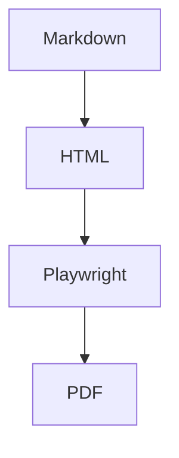

# Claude PDF Export Test

> [!info]
> 这是一个完整的 Markdown / Obsidian 测试文档。
>
> 用于验证：
>
> - Typography
> - Lists
> - Task Lists
> - Tables
> - Code Blocks
> - Math (KaTeX)
> - Images
> - Callouts
> - Footnotes
> - HTML
> - Mermaid
> - Links
> - Tags
> - Internal Links
> - Embeds
> - Definition Lists
> - Emoji
> - Blockquotes
> - Horizontal Rules

---

# Heading 1

正文测试。

Lorem ipsum dolor sit amet, consectetur adipiscing elit. Pellentesque habitant morbi tristique senectus et netus et malesuada fames ac turpis egestas.

## Heading 2

这是 **Bold**。

这是 _Italic_。

这是 _**Bold Italic**_。

这是 ~~Strikethrough~~。

这是 ==Highlight Test==。

这是 `Inline Code`。

这是一个 Emoji 😀🚀🎉

这是一个 [[Test Link]]

这是一个 [[Page#Heading]]

这是一个 [OpenAI](https://openai.com)

这是一个自动链接：

<https://github.com>

---

# Lists

## Unordered

- Apple
- Banana
- Orange
  - Orange 1
  - Orange 2
    - Orange 2-1
- Watermelon

---

## Ordered

1. 第一项
2. 第二项
3. 第三项
   1. 子项
   2. 子项
      1. 更深一级

---

## Task List

- [ ] 未完成
- [x] 已完成
- [ ] PDF 导出
  - [x] Markdown
  - [x] Code
  - [x] Formula
  - [ ] Mermaid
- [ ] 发布插件

---

# Blockquote

> 一级引用
>
> 第二行
>
> > 二级引用
> >
> > > 三级引用

---

# Callouts

> [!note]
> Note Callout

> [!tip]
> Tip Callout

> [!warning]
> Warning Callout

> [!danger]
> Danger Callout

> [!success]
> Success Callout

> [!bug]
> Bug Callout

> [!example]
> Example Callout

> [!quote]
> Quote Callout

---

# Horizontal Rule

---

---

# Picture


---

# Code

## TypeScript

```ts
interface User {
  id: number;
  name: string;
}

const user: User = {
  id: 1,
  name: 'Claude',
};

function hello(name: string) {
  console.log(`Hello ${name}`);
}

hello(user.name);
```

## JSON

```json
{
  "name": "Claude PDF",
  "version": "1.0.0",
  "theme": "Minimal"
}
```

## CSS

```css
body {
  background: #faf9f5;
  color: #141413;
}

h1 {
  font-size: 2rem;
}
```

## HTML

```html
<div class="card">
  <h2>Hello</h2>
</div>
```

## Bash

```bash
pnpm install

pnpm build

pnpm test
```

## Diff

```diff
- Old Line
+ New Line
```

---

# Table

| Name       | Language   |      Stars |
| ---------- | ---------- | ---------: |
| Obsidian   | TypeScript | ⭐⭐⭐⭐⭐ |
| Claude PDF | TypeScript |   ⭐⭐⭐⭐ |
| KaTeX      | JavaScript | ⭐⭐⭐⭐⭐ |

---

# Formula

行内公式：

勾股定理：

$a^2+b^2=c^2$

欧拉公式：

$e^{i\pi}+1=0$

二次方程：

$$
x=\frac{-b\pm\sqrt{b^2-4ac}}{2a}
$$

积分：

$$
\int_0^1x^2dx=\frac13
$$

矩阵：

$$
\begin{bmatrix}
1&2\\
3&4
\end{bmatrix}
$$

求和：

$$
\sum_{i=1}^{100}i=\frac{100\times101}{2}
$$

---

# HTML

<kbd>Ctrl</kbd> + <kbd>S</kbd>

<mark>HTML Highlight</mark>

<del>Test Del</del>

<u>a</u>

<sup>2</sup>

<s>Test S</s>

<!-- <abbr>Test Abbr</abbr> -->

---

# Footnote

这里有一个脚注。[^1]

还有第二个。[^long]

[^1]: 一个简单脚注。

[^long]: 这是一个比较长的脚注，用于测试 PDF 是否正确分页以及脚注样式。

---

# Definition List

Markdown
: 一个轻量级标记语言

Obsidian
: 一个知识管理软件

KaTeX
: 一个数学公式渲染库

---

# Emoji

😀 😁 😂 🤣 😎 🚀 ❤️ 👍 👎 🎉 📚 💡 ⚠️ ❌ ✅

---

# Mixed Content

> [!example]
>
> ## Claude PDF
>
> 一个混合内容区域。
>
> - [x] Markdown
> - [x] Code
> - [x] Table
> - [x] Formula
> - [ ] Mermaid
>
> ```ts
> export function add(a: number, b: number) {
>   return a + b;
> }
> ```
>
> 行内公式：
>
> $E=mc^2$
>
> 块公式：
>
> $$
> \sum_{i=1}^{n}i=\frac{n(n+1)}2
> $$

---

# Mermaid（如果支持）



---

# Long Paragraph

Lorem ipsum dolor sit amet, consectetur adipiscing elit. Sed non risus. Suspendisse lectus tortor, dignissim sit amet, adipiscing nec, ultricies sed, dolor. Cras elementum ultrices diam. Maecenas ligula massa, varius a, semper congue, euismod non, mi.

Vivamus fermentum semper porta. Nunc diam velit, adipiscing ut tristique vitae, sagittis vel odio. Maecenas convallis ullamcorper ultricies.

---

# Checklist

- [ ] Heading
- [ ] Paragraph
- [ ] Quote
- [ ] Callout
- [ ] Table
- [ ] Formula
- [ ] Image
- [ ] Code
- [ ] Mermaid
- [ ] HTML
- [ ] Footnote
- [ ] Definition List
- [ ] Embed
- [ ] Internal Link
- [ ] External Link
- [ ] Emoji

---

# End

> [!success]
>
> 🎉 如果以上内容都正确显示，那么你的 PDF 导出已经覆盖了绝大多数 Markdown 与 Obsidian 场景。
